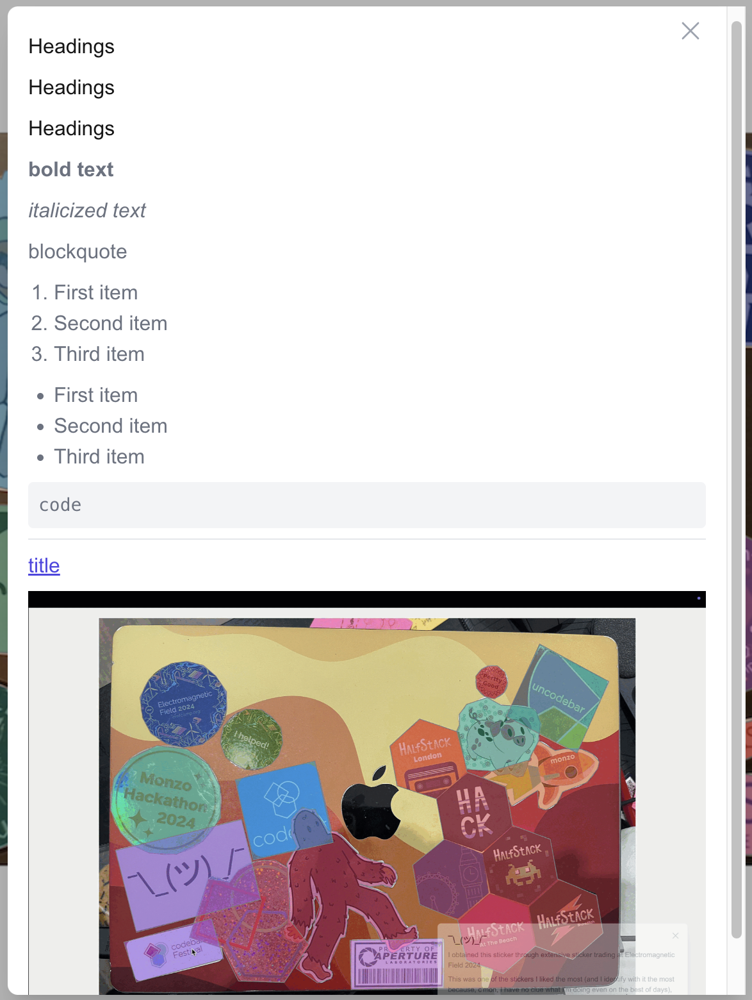

# stickers


An annotated guide to my laptop stickers.

This is a very, very rough first pass.

## Running locally 

Install [Node.js](https://nodejs.org/) (if you don't already have it installed).

Check if you have node installed correctly with

```bash
node -v
npm -v
```

Clone the project with and navigate into it with

```bash
git clone https://github.com/leoriviera/stickers.git
cd stickers
```

Setup project and install required packages with

```bash
npm install
```

Finally, build the static site and start run the app with

```bash
npm run build
npm run start
```

Navigate to [http://localhost:3000/](http://localhost:3000) to see an example image annotation or to [http://localhost:3000/generate](http://localhost:3000/generate) to create your own. 


You can use (most, headings are not yet supported: see below) Markdown in labels:



```markdown

# Headings

## Headings

### Headings

**bold text**

*italicized text*

> blockquote

1. First item
2. Second item
3. Third item

- First item
- Second item
- Third item

`code`

---

[title](https://www.example.com)


```

Once you're happy with your sticker annotations you can save them and then replace the `src/app/annotations.json` file with your newly exported annotations to swap out my laptop stickers on the homepage with yours.


## Things to do

* Improve the editor
* Compress the images on upload
* Possibly encode in Base85 to reduce the size of the images
* Accept HEICs and convert them to JPEGs
* Add a way to "swap out" images, so that the annotations can be preserved when the image is updated **done**
* Improve the colours when creating annotations
* Allow moving/removing/editing of points in annotations
* Better branding (add a favicon, some OpenGraph images, etc.)s
* ~~Render line breaks in the annotations~~ **done**

## Contributing

First fork the repo and clone it, then check out the main branch and get all upstream changes

```bash
git checkout main
git pull
```

Open a new branch locally

```bash
git switch -c "your-branch-name"
```

During development for hot-reloading run the project with 

```bash
npm run dev
```

Before raising a PR check your code with

```bash 
npm run lint
```

Stage, commit, and push your changes as usual. No fancy ways of working here.

```bash
git add .
git commit -m "Use a descriptive commit name though"
git push
```

Raise a PR with a nice description of what you changed.
